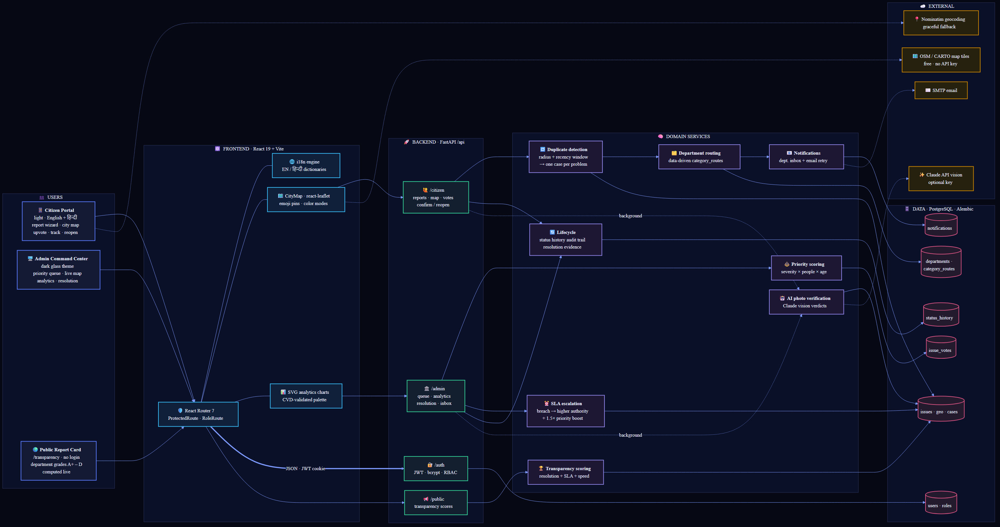
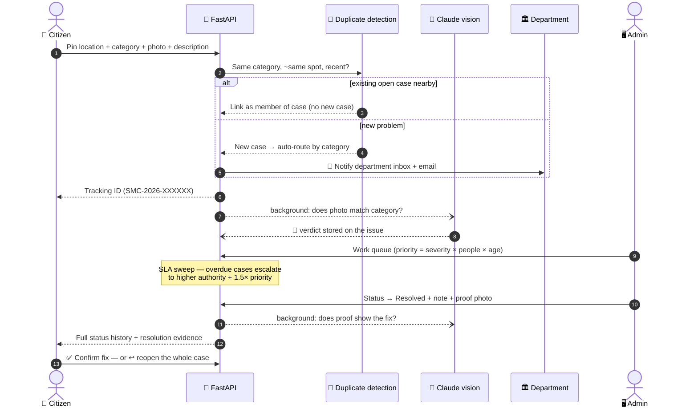

# 🏙 SmartCity — Civic Issue Reporting & Resolution Platform

> **Report it once. Track it live. Hold the city accountable.**

Citizens pin civic problems — potholes, dead streetlights, overflowing bins, water leaks — on a map with photo evidence. The administration sees every real-world problem **exactly once** (deduplicated automatically), routed to the right department, ranked by real impact, escalated when it sits too long, and worked through a fully audited lifecycle until the **reporter themselves confirms the fix**. A public report card scores every department on how well they actually deliver.

    

---

## 🏗 Architecture

Every layer below is real, tested code in this repository — the diagram source lives in [`docs/architecture.mmd`](docs/architecture.mmd).



**How a report flows through the system:**



---

## ⚡ The features that make it powerful

### 🔁 One problem = one case (custom duplicate detection)
Fifteen people reporting the same pothole doesn't create fifteen tickets. Each new report is checked against **per-category geographic radii** (25 m for a pothole … 80 m for a water leak) and **recency windows** (3–60 days) — a match links the report into the existing case, and every reporter still tracks it under their own ID. The citizen count then *boosts* the case's priority, so mass-reported problems rise to the top instead of clogging the queue.

### ⏰ SLA escalation — nothing rots in a queue
Every category has a service-level limit (2 days for garbage overflow … 10 for damaged property). An idempotent sweep runs on every admin load: breached cases get flagged **⚠ SLA breached**, boosted ×1.5 in priority, logged in their audit trail, and General Administration — the higher authority — is notified automatically.

### 🤖 AI photo verification (Claude vision)
Every uploaded report photo is checked in the background against the claimed category — *"does this actually look like a pothole?"* — and every proof-of-resolution photo against *"does this show the issue fixed?"*. Verdicts surface as badges in the admin queue with a one-sentence reason. No API key? The system degrades gracefully to unverified. Submissions never block on AI.

### 🏆 Public transparency report card
`/transparency` needs **no login**. Every department gets a live 0–100 score and an A+–D grade from three weighted signals — resolution rate (50 %), resolved-within-SLA rate (30 %), and speed vs a 14-day baseline (20 %) — computed straight from the database on every request. Nobody curates it; the methodology is printed on the page.

### 🗺 Live city map with citizen upvoting
Every active case is an emoji pin, color-coded by **status or category** (toggle), with popups showing report counts, department, and tracking ID. Citizens **upvote** problems that affect them straight from the popup — reporters can't double-dip on their own case — and votes feed directly into the priority formula departments work from.

### 🔄 A lifecycle that closes the loop
Every transition is recorded in an immutable **status history** — who (citizen or administration), old → new status, note, photo, timestamp. Admins attach resolution notes and proof photos; reporters see the full trail and get the last word: **"Yes, it's fixed"** or **"No, reopen it"** — and reopening a duplicate reopens the *whole case* for everyone.

### 🌐 Bilingual, phone-first
A 🌐 switcher flips the entire citizen experience — navigation, the 5-step wizard, categories, statuses, timeline, lifecycle updates — between **English and हिन्दी**, persisted per device. Adding another regional language is one dictionary file. Everything is responsive down to a 375 px phone, because citizens report from the street.

### 📊 Analytics computed live, drawn by hand
The admin analytics tab is 100 % real aggregation — category/status/department splits, average resolution time, department comparison, and **hotspot detection** (~110 m grid cells that keep collecting reports). Charts are hand-built SVG with a palette validated for color-vision deficiency on the dark surface — no chart library, no fake numbers.

### 🛡 Security that isn't just hidden buttons
Role-based access control is enforced **on the backend** — every admin endpoint rejects citizens with 403 and vice versa, covered by tests. Uploads are validated by magic bytes (not just extensions), JWTs live in HTTP-only cookies, and passwords are bcrypt-hashed.

---

## 🗺 Maps & Geolocation API — what we chose and why

| Concern | Choice |
|---|---|
| Map rendering | [Leaflet 1.9](https://leafletjs.com/) via [React-Leaflet 5](https://react-leaflet.js.org/) |
| Base tiles (citizen, light) | OpenStreetMap standard raster tiles |
| Base tiles (admin, dark) | CARTO *Dark Matter* tiles (OSM data) |
| Reverse geocoding | [OSM Nominatim](https://nominatim.org/) `reverse` API |
| Device location | Browser Geolocation API |

**Why.** We evaluated three options: **Google Maps Platform** (best data, but API key + billing + restrictive caching terms), **Mapbox GL JS** (beautiful vector tiles, but key-bound and a heavy bundle), and **Leaflet + OpenStreetMap** — which we chose: completely free and key-less (nothing to leak, nothing to bill), open data, a ~42 KB library with mature React bindings, and provider-agnostic — any XYZ tile server swaps in via env config, which is exactly how the admin map uses CARTO's dark tiles. Nominatim adds free reverse geocoding on the same open dataset. Trade-offs accepted: raster tiles are less polished than vector maps, and public Nominatim has fair-use rate limits — both swappable behind `VITE_MAP_TILE_URL` / `VITE_MAP_TILE_URL_DARK` / `VITE_GEOCODING_URL` if the city later pays for a commercial provider.

**How it's integrated** (all under `frontend/src`):

- `citizen/components/LocationPicker.jsx` — reporting step 2: tap-to-pin, draggable marker, **"Use my current location"** (with denial/timeout fallback messaging), and abortable reverse geocoding that auto-fills the address. If geocoding fails, coordinates are used — a report never blocks on a third-party service.
- `shared/components/CityMap.jsx` — the shared live map: one emoji marker chip per case with a colored ring (status or category mode), vote buttons, auto `fitBounds`, and a legend computed from what's actually on screen.
- `citizen/components/IssueLocationMap.jsx` — static mini-map on each report's detail page.

---

## ✅ Requirement coverage

| # | Requirement | Where it lives |
|---|---|---|
| 1 | Two-role auth & backend-enforced RBAC | `app/core/dependencies.py` (`require_roles`), `RoleRoute` on the frontend |
| 2 | Map-based reporting (pin + category + photo + description) | `ReportIssue` wizard + [maps section](#-maps--geolocation-api--what-we-chose-and-why) |
| 3 | Duplicate detection (own algorithm) | `app/services/citizen.py` — radius + recency case grouping |
| 4 | Automated department routing (extensible) | `category_routes` table — add a category with a DB row, zero code |
| 5 | Issue lifecycle & status workflow | Status history, resolution notes & proof, citizen confirm/reopen |
| 6 | Interactive city map | `CityMap` — color-coded live markers for both roles |
| 7 | Admin analytics dashboard (real data) | `/api/admin/analytics` — splits, avg resolution, comparison, hotspots |
| 8 | Database integration | PostgreSQL · SQLAlchemy 2 · 7 Alembic migrations — users, issues, locations, history, departments, votes, evidence |
| 9 | Responsive, purpose-built UIs | Light phone-first citizen portal vs dark data-dense admin |
| 10 | Error handling | GPS denial, upload validation (type/size/magic bytes), geocoding fallback, retryable error states |

**Beyond the brief:** SLA escalation · citizen upvoting · public transparency score · multi-language (EN/हिन्दी) · AI photo verification — all detailed [above](#-the-features-that-make-it-powerful).

---

## 🚀 Getting started

### Backend

```bash
cd backend
python -m venv .venv
.venv\Scripts\activate            # source .venv/bin/activate on macOS/Linux
pip install -r requirements.txt
copy .env.example .env            # set DATABASE_URL + JWT_SECRET_KEY (ANTHROPIC_API_KEY optional)
alembic upgrade head
uvicorn app.main:app --reload --port 8000
```

Create an administrator:

```bash
python -m scripts.create_admin admin@city.gov <password>
```

### Frontend

```bash
cd frontend
npm install
npm run dev                       # http://localhost:5173 — proxies /api to :8000
```

### Tests

```bash
cd backend && pytest              # 110 tests — auth/RBAC, duplicates, routing, lifecycle, SLA, votes, transparency, AI verification
cd frontend && npm test           # 59 tests — wizard, dashboards, maps, lifecycle UI, i18n, badges
```

---

## 📚 Documentation

| Document | Contents |
|---|---|
| [api-documentation.md](api-documentation.md) | Full endpoint reference — auth, citizen, admin, public |
| [docs/architecture.mmd](docs/architecture.mmd) | Editable Mermaid source of the architecture diagram |
| `backend/.env.example` | Every configuration knob, annotated |

**Tech stack:** FastAPI · SQLAlchemy 2 · Alembic · PostgreSQL · Pydantic v2 · React 19 · Vite · React Router 7 · react-leaflet · Anthropic Claude API (vision) · pytest · Vitest + Testing Library.
